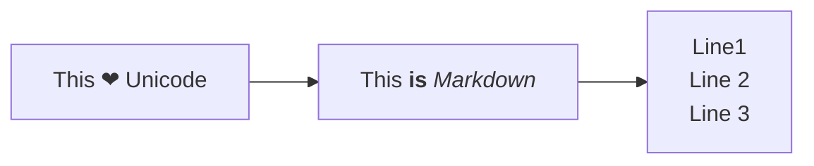

# rust-new-project-template
A good starting point for a new Rust project

## Diagrams

(using mermaid)

```mermaid
flowchart LR
    id["This ❤ Unicode"]
    markdown["`This **is** _Markdown_`"]
    newLines["`Line1
    Line 2
    Line 3`"]
    id --> markdown
    markdown --> newLines
```

## References

* [rust-cli-template](https://github.com/kbknapp/rust-cli-template)
